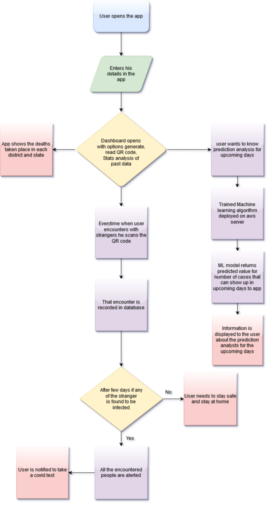

# SCANOVID19

COVID-19 the ongoing global pandemic has caused distress among the government of countries all over the world. Currently in India a single infected person can infect 406 people in 30 days so tracking the whereabouts and the number of people encountered every day by these probable patients is a real struggle with such a huge population. Despite the lockdown people go out and come in contact with strangers to fetch their daily needs. It takes days for the symptoms to show. So, there is no way to track the stranger who has come in contact with the infected person for at least a weak. But if there was a database for the individuals coming in contact on a daily basis, the curve of infected patients would flatten faster. 

##### SCANOVID19 is an app-based solution that will keep the track of the number of people you encounter when you enter grocery stores, public transports, banks or any such enterprise through unique ID and QR code scanners. As a result of which if any user gets infected an alert will be sent to all those people who were in close contact of the infected person in 14 days.

