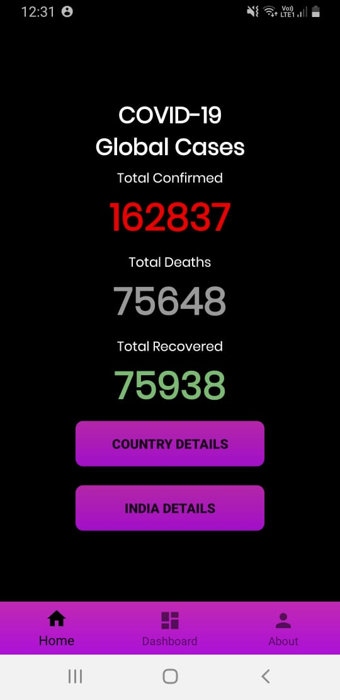
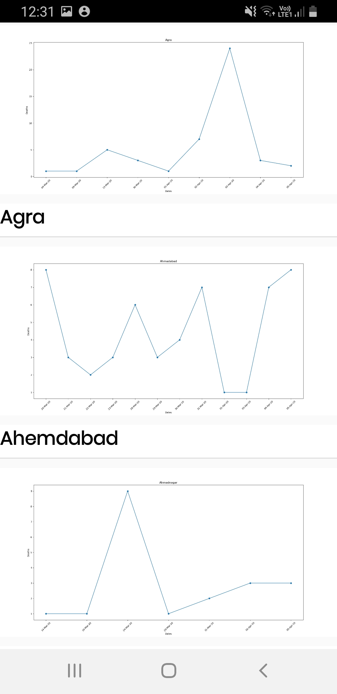

# SCANOVID19

COVID-19 the ongoing global pandemic has caused distress among the government of countries all over the world. Currently in India a single infected person can infect 406 people in 30 days so tracking the whereabouts and the number of people encountered every day by these probable patients is a real struggle with such a huge population. Despite the lockdown people go out and come in contact with strangers to fetch their daily needs. It takes days for the symptoms to show. So, there is no way to track the stranger who has come in contact with the infected person for at least a weak. But if there was a database for the individuals coming in contact on a daily basis, the curve of infected patients would flatten faster. 

#### SCANOVID19 is an app-based solution that will keep the track of the number of people you encounter when you enter grocery stores, public transports, banks or any such enterprise through unique ID and QR code scanners. As a result of which if any user gets infected an alert will be sent to all those people who were in close contact of the infected person in 14 days.

## Features

1. Generates a QR code that will produce the required code for other users to scan it and store the required information about the user in the database.

2. The read QR code option will allow the user to view the necessary details of the person whose QR code is being scanned by the former.

3. The view list option allows the user to view all the encounters he had with others with details of every individual.

4. The Dashboard option gives the predicted value of all the global cases of the ongoing COVID-19 pandemic for updating our users.

5. The machine learning model in our application predicts not only the global cases but also gives user the report about the ongoing pandemic state and district wise. 

6. This machine learning model was effectively deployed on the server of AWS so as to perform the training and the prediction of model over the server itself. 

7. The model predicts and generates the graph of information district-wise allowing the users to view the number of deaths and status in their locality.

8. The aim of prediction is to determine what will be the situation of the pandemic locally in a user’s area and what precautions they must take in order to keep themselves safe.

## App-Flow Diagram

## Screenshots

{:height="700px" width="400px"}

{:height="700px" width="400px"}

